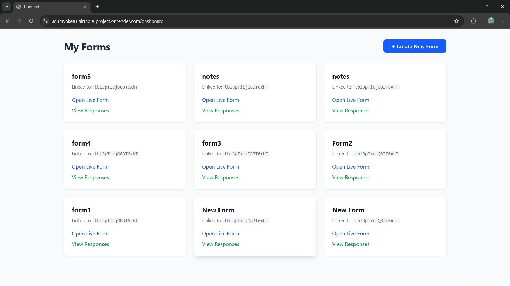
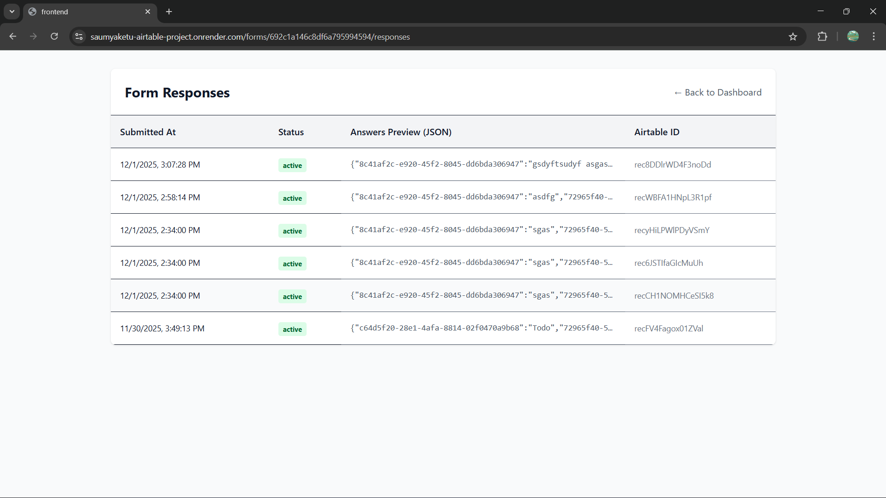
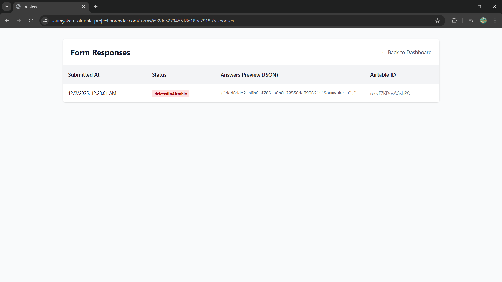
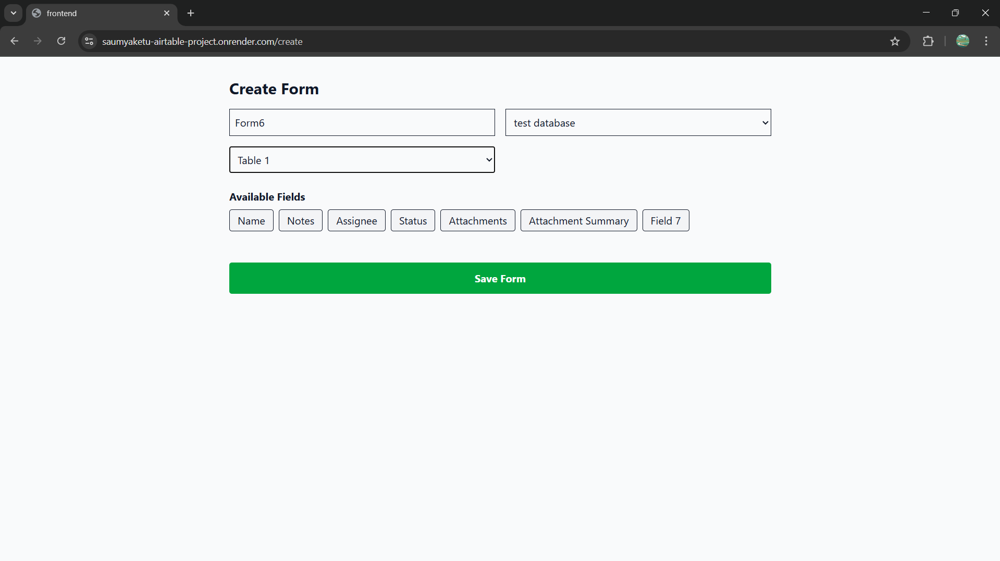
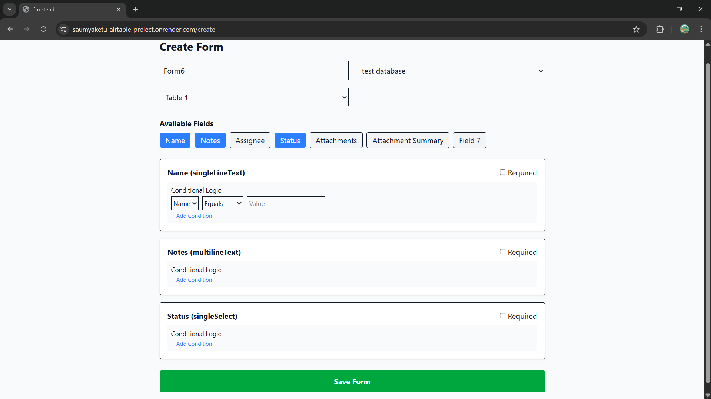

# Airtable-Connected Dynamic Form Builder

A full-stack MERN application that allows users to generate dynamic forms based on their Airtable schemas. It supports OAuth authentication, conditional logic for questions, dual-write storage (MongoDB + Airtable), and real-time synchronization via Webhooks.

## Live Demo

  * **Live Link:** [https://saumyaketu-airtable-project.onrender.com]

## Tech Stack

**Frontend:**

  * React (Vite)
  * TailwindCSS (Styling)
  * Axios (API Consumption)
  * React Router DOM

**Backend:**

  * Node.js & Express
  * MongoDB
  * JWT (Session Management)

**Integrations:**

  * Airtable Web API (OAuth, Records, Meta)
  * Airtable Webhooks

-----

## Features

1.  **Airtable OAuth Login:** Secure authentication using Airtable's OAuth2 flow.
2.  **Dynamic Form Builder:** Fetches Bases and Tables dynamically from the user's Airtable account.
3.  **Conditional Logic Engine:** Questions can be shown/hidden based on previous answers using `AND`/`OR` logic.
4.  **Dual-Storage Submission:** Responses are saved to MongoDB immediately and synced to Airtable.
5.  **Webhook Synchronization:** If a record is edited or deleted in Airtable, the MongoDB database updates automatically to reflect the change.
6.  **Response Viewer:** A dashboard to view all collected form responses and their sync status.

-----

## ⚙️ Setup Instructions

### Prerequisites

  * Node.js (v18+)
  * MongoDB (Local or Atlas)
  * Airtable Account

### 1\. Clone the Repository

```bash
git clone https://github.com/Saumyaketu/Airtable_Project
cd <project-folder>
```

### 2\. Backend Setup

Navigate to the server directory, install dependencies, and configure environment variables.

```bash
cd server
npm install
```

CXreate a `.env` file in the `server` directory:

```env
PORT=5000

MONGODB_URI=mongodb://localhost:27017/airtable_forms

JWT_SECRET=super_secret_key_123

AIRTABLE_CLIENT_ID=your_airtable_client_id
AIRTABLE_CLIENT_SECRET=your_airtable_client_secret
AIRTABLE_REDIRECT_URI=http://localhost:5173/auth/callback

# Use ngrok for local testing of webhooks
CLIENT_URL=http://localhost:5173 

SERVER_URL=http://localhost:5000 
```

Start the server:

```bash
npm run dev
```

### 3\. Frontend Setup

Navigate to the client directory.

```bash
cd client
npm install
```

Create a `.env` file in the `client` directory:

```env
VITE_API_URL=http://localhost:5000

VITE_AIRTABLE_CLIENT_ID=your_airtable_client_id
```

Start the frontend:

```bash
npm run dev
```

-----

## Airtable Configuration

To make the app work, you must register an integration with Airtable.

1.  Go to **[Airtable Builder](https://airtable.com/create/oauth)**.
2.  Click **Create new integration**.
3.  **Name:** Form Builder App.
4.  **Redirect URL:** `http://localhost:5173/auth/callback` (or deployed frontend URL).
5.  **Scopes:** Ensure the following scopes are added:
      * `data.records:read`
      * `data.records:write`
      * `schema.bases:read`
      * `webhook:manage`
6.  Copy the **Client ID** and **Client Secret** into your `.env` files.

-----

## Data Models

### User

Stores Airtable credentials for API access.

  * `airtableId`: Unique ID from Airtable.
  * `accessToken`: OAuth access token.
  * `refreshToken`: OAuth refresh token (for keeping sessions alive).

### Form

Defines the structure of the form.

  * `questions`: Array of objects containing:
      * `label`, `type`, `required`.
      * `conditionalRules`: Logic for visibility.
  * `airtableBaseId` & `airtableTableId`: Links the form to specific Airtable resources.
  * `webhookId`: The ID of the webhook registered for this form/table.

### Response

Stores user submissions.

  * `answers`: JSON object of key-value pairs.
  * `airtableRecordId`: ID of the created record in Airtable.
  * `status`: `active` or `deletedInAirtable` (updated via webhook).

-----

## Conditional Logic Explanation

The application uses a dedicated Logic Engine (`utils/logicEngine.js`) to determine if a question should be visible.

**Structure:**
A question has `conditionalRules` containing:

1.  **Logic:** `"AND"` (all conditions must be true) or `"OR"` (at least one must be true).
2.  **Conditions:** An array of rules checking against other questions.

**Operators Supported:**

  * `equals`: Answer matches value exactly.
  * `notEquals`: Answer does not match value.
  * `contains`: String contains substring (or Array contains item).

**Example Flow:**

1.  User answers "Engineer" for "Job Role".
2.  The "GitHub Profile URL" question has a rule: `Show if 'Job Role' equals 'Engineer'`.
3.  The engine evaluates the rule; if true, the question renders.

-----

## Webhook Configuration

The application automatically registers a webhook when a new Form is created.

**How it works:**

1.  When a form is created via the UI, the backend calls `POST /webhooks` on Airtable.
2.  It registers your server's URL (e.g., `https://your-api.com/api/webhooks/airtable`) as the notification target.
3.  When a record is **Updated** or **Deleted** in Airtable:
      * Airtable pings your server.
      * The server fetches the payload using the cursor.
      * It updates the local MongoDB `Response` document (syncing data or marking as deleted).

**Note for Localhost:**
Webhooks cannot reach `localhost`. To test webhooks locally, use **[ngrok](https://ngrok.com/)**:

1.  Run `ngrok http 5000`.
2.  Update `CLIENT_URL` in `server/.env` to the HTTPS ngrok URL.

-----

## Screenshots
**Dashboard:**


**Form-Viewer:**


**Form-Viewer-2:**


**Form-Builder-1:**


**Form-Builder-2:**
